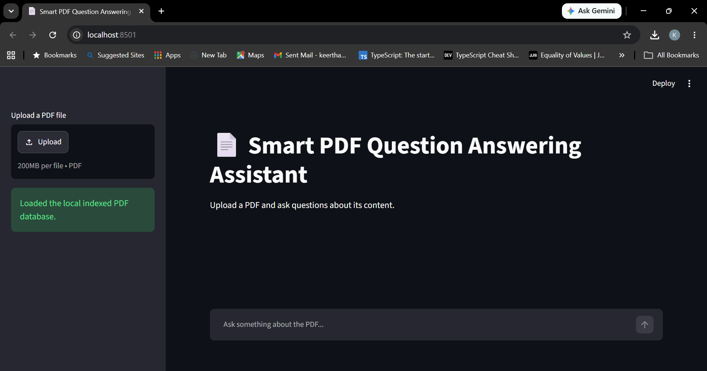
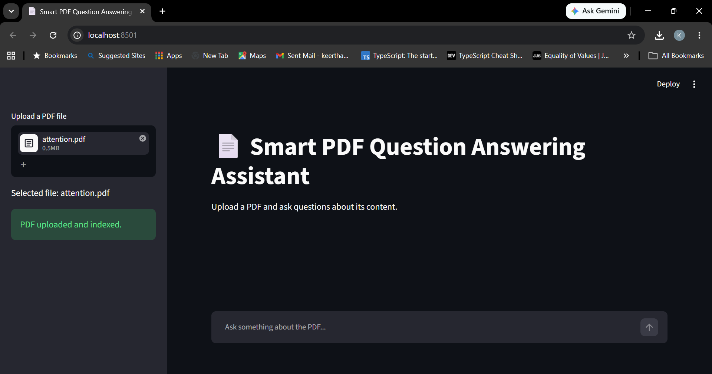
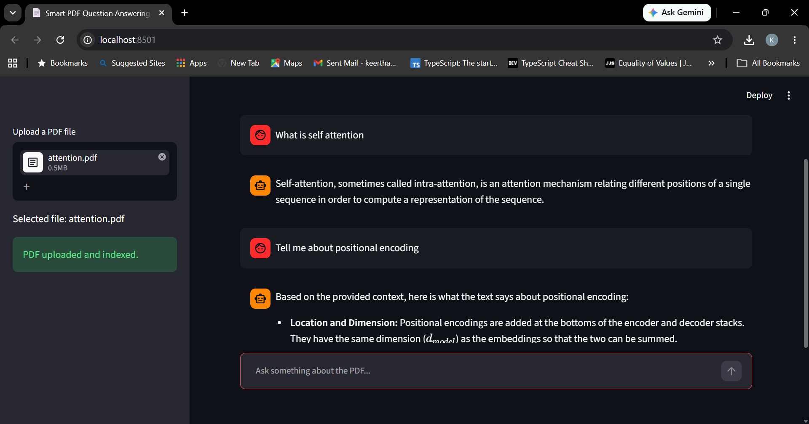

# Smart PDF Question Answering Assistant

A Retrieval-Augmented Generation (RAG) application built with Python, LangChain, FAISS, HuggingFace Embeddings, and Google Gemini.

The application reads a PDF document, creates vector embeddings, stores them in a FAISS vector database, and answers user questions using the contents of the document.

---

## Features

- Upload PDF documents through the UI
- Split text into chunks
- Generate embeddings using HuggingFace
- Store embeddings in FAISS
- Retrieve relevant context
- Answer questions using Google Gemini
- Command-line and Streamlit interface

---

## Tech Stack

- Python
- LangChain
- Google Gemini API
- HuggingFace Embeddings
- FAISS
- PyPDF
- dotenv

---

## Project Structure

```
smart-pdf-assistant/
│
├── app.py
├── streamlit_app.py
├── requirements.txt
├── .env
│
├── data/
│   └── sample.pdf  # optional demo PDF; you can delete this file if you don't need it
│
├── faiss_index/   # optional local FAISS index storage
│
└── modules/
    ├── llm.py
    ├── embeddings.py
    ├── pdf_loader.py
    ├── text_splitter.py
    ├── vector_store.py
    ├── rag_pipeline.py
    ├── prompts.py
```

---

## Installation

Clone the repository.

```bash
git clone <repository-url>
```

Create a virtual environment.

```bash
python -m venv venv
```

Activate the environment.

Windows

```bash
venv\Scripts\activate
```

Install dependencies.

```bash
pip install -r requirements.txt
```

---

## Environment Variables

Create a `.env` file.

```
GOOGLE_API_KEY=your_google_api_key
```

---

## Run the Application

Use the Streamlit interface to upload any PDF and start asking questions.

```bash
python -m streamlit run streamlit_app.py
```

You can also run the basic command-line interface:

```bash
python app.py
```

Example:

```
Ask a question:

What is Python?

Answer:

Python is a general-purpose programming language with simple syntax...
```

---

## Workflow

```
PDF
   ↓
Load Document
   ↓
Split into Chunks
   ↓
Generate Embeddings
   ↓
Store in FAISS
   ↓
Retrieve Relevant Chunks
   ↓
Gemini
   ↓
Answer
```

---

## Screenshots

These are example screenshot placeholders. Replace the paths with your actual files after capturing the UI and results.

### App UI



### Uploaded PDF



### Answer Output



---

## Future Improvements

- Multiple PDF support
- Source citations
- Conversation memory

---
